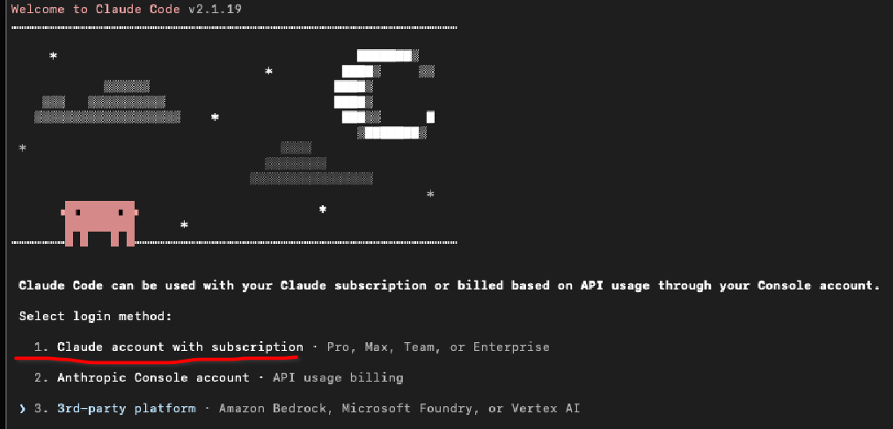
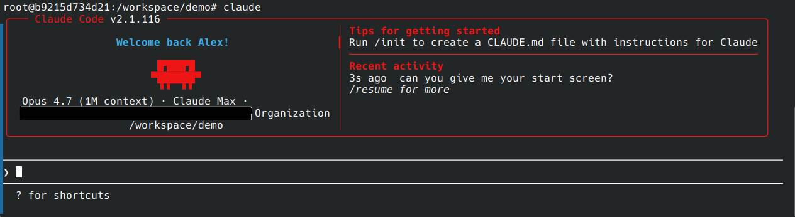
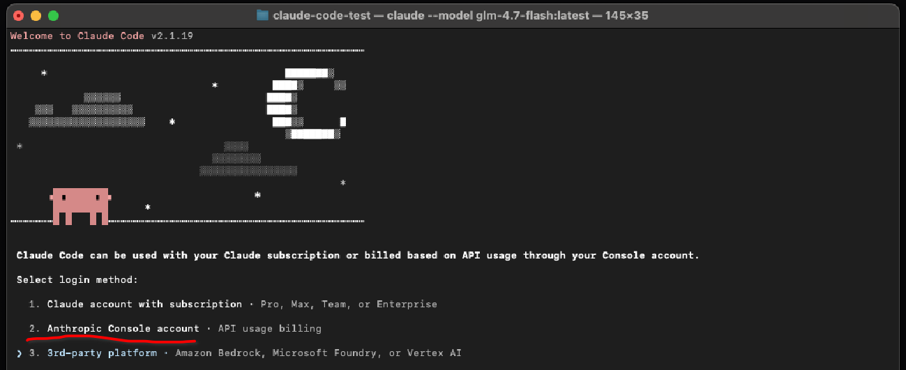

::: {.callout-note appearance="simple"}
**Who is this for?** Master's and PhD students in economics who have used ChatGPT in a browser but have never driven a coding agent from the terminal. By the end you will have **Claude Code** running locally against either a Claude Max subscription or Anthropic API tokens, a mental model of what an agent is, and a feel for the basic interaction loop.

**Prerequisites:** Docker container from the **Docker Setup How-To**. Either a **Claude Max** subscription, or a credit card to load **\$5** into an Anthropic API account. We set up both paths below.

**What comes next:** The [**AI Agents** workshop](../../AI_Agents/) (Day 2) is the deep dive: turn a messy R project into an AEA-compliant replication package using Claude Code end-to-end.

**Want to use non-Claude models (GPT-5, DeepSeek, Gemini)?** See the **Aider + OpenRouter appendix** in the Day 2 tutorial for a flexible multi-model setup.
:::

---

# Part 0. Why this workshop exists {#why}

Two reasons.

**Speed.** Tasks that used to fill a day (reorganising a folder, drafting a README, writing a download script, styling a figure, rewriting notes into a proper methods section) compress to minutes. You still make the research decisions. The agent does the typing.

**Calibration.** Your adviser, your future co-authors, and the researchers whose papers you read will soon all be using these tools, if they aren't already. You need to know what they can and can't do, what they miss, and how to spot it. The only way to get calibrated is to use one yourself.

A short note on framing. Some of the best public writing on how to get started with coding agents comes from Paul Goldsmith-Pinkham ([Part 1](https://paulgp.substack.com/p/getting-started-with-claude-code), [Part 2](https://paulgp.substack.com/p/from-an-empty-folder-to-a-figure)). The lenses we use in the first few parts (the ladder of AI coding tools, the RA metaphor, the long-document framing, the four prompt patterns) are his, adapted for Claude Code.

**Why Claude Code?** Because it has the richest agent harness today: first-class plan mode, subagents, custom skills, hooks, permission allow-lists, and clean handling of long refactors. For a research workflow, those features matter more than absolute model cost. If you specifically need another model family, we cover that in the Day 2 tutorial appendix.

---

# Part 1. Chatbot vs agent: same task, felt difference {#chatbot-vs-agent}

The ladder in Part 2 tells you where agents *sit*. This section is about what it *feels* like to use one versus the chatbot you already know. The difference isn't "better answers". It's that the agent has **hands**.

Four worked examples from real research work.

## 1. "What packages does this project use?"

You've inherited a folder with seven R scripts. You want a deduplicated list of every `library()` call, ready to drop into a `00_setup.R`.

::: {.panel-tabset}

### Chatbot workflow

1. Open `analysis_v2_FINAL.R`. Select all. Copy.
2. Paste into ChatGPT: *"List every `library()` call in this script."*
3. Get a bullet list.
4. Repeat for the six other files.
5. Merge the seven lists by hand. Deduplicate.
6. Convert the bullet list into a working R script yourself.

About ten minutes, counting the tab-switching.

### Agent workflow

One prompt in Claude Code:

```
▸ Across all R scripts in this folder, list every library() call.
  Deduplicate and write a single 00_setup.R that loads them.
```

Twenty seconds. You get a working, runnable script, not a bullet list you then have to turn into code.

:::

**What changed:** the chatbot is locked inside its text box. The agent can open your files and write new ones. It has hands.

## 2. "This script broke. Fix it."

Your analysis script errors out. You want it to work.

::: {.panel-tabset}

### Chatbot workflow

1. `Rscript analysis.R` produces an error. Copy the traceback.
2. Paste into the chatbot: *"What does this error mean?"*
3. Chatbot: *"You need to install `libcairo2-dev` via apt."*
4. Install. Re-run. New error.
5. Copy traceback. Paste. Get another suggestion.
6. Apply. Re-run. R library path problem.
7. Repeat.

You are a courier between two systems that don't know about each other.

### Agent workflow

```
▸ Run Rscript analysis.R and fix whatever breaks until it completes.
  Install any missing system packages. Commit the changes.
```

The agent runs the script, sees the failure, patches the code or the environment, re-runs, and tells you when it's done.

:::

**What changed:** the agent closes the loop. The chatbot's loop passes through you.

## 3. "Rename X to Y across twelve files"

You want to replace every `read.csv(...)` with `readr::read_csv(...)`, keeping quoted column names untouched. Twelve files.

::: {.panel-tabset}

### Chatbot workflow

Impractical by paste. In practice you write a `sed` or `rg -r` command yourself, and hope quoted strings aren't hit. The chatbot can *describe* the command; it can't run it on your files.

### Agent workflow

```
▸ In every R script in this folder, replace `read.csv(` with
  `readr::read_csv(`. Don't change the quoted column names or
  any other arguments. Commit the change with a clear message.
```

Done. With a commit you can read and revert.

:::

**What changed:** bulk edits become a conversation, not a scripting problem.

## 4. "Show me three styles of this plot"

You have a draft figure. You're not sure which style fits.

::: {.panel-tabset}

### Chatbot workflow

Describes three styles in prose. You translate prose back into ggplot2 code. Three times. Run each. Save each. Compare.

### Agent workflow

```
▸ Take plot_iris.R and produce three variants: (a) minimal theme,
  (b) Kieran Healy style, (c) The Economist style. Save each as a
  PDF in figures/. Leave the original untouched.
```

Three PDFs appear in `figures/`. Open them side by side. Pick one. Iterate.

:::

**What changed:** experimentation gets cheap.

## So, when are agents actually worth it?

Not for everything. This is a tool, not a miracle.

| Task shape | Agent worth it? |
|---|---|
| Inventory / audit of an unfamiliar folder | ✓ big win |
| Bulk rewrites (rename, reformat, port) | ✓ big win |
| Run / fail / fix loops | ✓ closes its own loop |
| Generate / iterate variants | ✓ concrete comparable output |
| Glue work (download, parse, save, plot) | ✓ chains shell + code + files |
| Novel research ideas | ✗ use your own brain |
| Non-trivial econometric identification | ✗ think slowly |
| Final-paper writing | ✗ polish yourself |
| Anything with sensitive data | ✗ never |

The pattern: **agents win on the paperwork around the research**, not the research itself.

::: {.callout-tip}
## You should play with this on your own, seriously
Reading this handout won't give you the felt difference. The only way is to open a terminal and try things that would normally take you an afternoon:

- "Write a Python script that downloads monthly BLS employment data for one US state and plots it over time."
- "Take these three R scripts from my last seminar paper and merge them sensibly, preserving every regression."
- "Summarise this paper for my thesis literature review."
- "Port my `data.table` pipeline to `dplyr`."
- "Write a LaTeX beamer deck from the outline in `notes.md`."
:::

---

# Part 2. The ladder of AI coding tools {#ladder}

When someone says "I tried AI coding and it wasn't that good", they are almost always talking about Level 1. Here is the whole ladder.

```{=html}
<div style="margin: 20px 0;">
  <div class="ladder-rung"><span class="level">Level 0</span> Copy-paste between ChatGPT and your editor. You do the integration.</div>
  <div class="ladder-rung"><span class="level">Level 1</span> Autocomplete in the IDE (GitHub Copilot). Suggestions as you type.</div>
  <div class="ladder-rung"><span class="level">Level 2</span> IDE-based agent (Cursor, Continue, Windsurf). Multi-file edits inside the editor.</div>
  <div class="ladder-rung current"><span class="level">Level 3</span> <strong>Terminal agent (Claude Code, Aider, Codex, Gemini CLI). Reads and writes files, runs your shell, iterates on errors. TODAY.</strong></div>
  <div class="ladder-rung"><span class="level">Level 4</span> Orchestrated agents. Multiple agents running headless, reviewing each other, running in CI.</div>
  <div class="ladder-rung"><span class="level">Level 5</span> Long-horizon autonomy. Turn a task loose for an hour and come back to a PR.</div>
</div>
```

If you tried Copilot two years ago and decided AI coding is underwhelming, you were at Level 1. Level 3 is a different kind of tool. It does not suggest, it *does*.

---

# Part 3. Mental models before commands {#mental-models}

Three framings that will save you a lot of grief.

## An RA that lives on your computer

Not a search engine. Not a chatbot. Think of it as a competent but junior research assistant who happens to have a terminal open on your project. You give instructions. It works. You verify. Sometimes it misreads the instruction, takes a shortcut, or produces results that look right but aren't. You would check an RA's work; you check the agent's work for the same reasons.

> If you would hire the RA without checking their first output, you are hiring wrong. The agent is no different.

## You are not having a conversation

You are passing a very long document back and forth. Each turn, the agent receives the entire prior conversation plus the files you've added plus a repository map plus your new message. It reads all of it, writes a reply, and the cycle repeats.

This matters because the document fills up. Claude's context window is 200k tokens (or 1M on newer models). It sounds like a lot. It fills up faster than you'd think, especially when you add large files or run verbose shell commands whose output lands back in the chat.

## Context degradation is the single most important idea

As the conversation grows, performance drops. The agent has more to keep track of, and it starts losing the thread. You see this as the agent forgetting an earlier rule, making sloppier edits, or giving a vague summary instead of a concrete answer.

The fix is session hygiene, not a bigger context window:

- **`/clear`** when you're switching topics. Keeps files, drops history.
- **`/compact`** when a session is clearly bloated but you want to keep working.
- Break big tasks into several short sessions, with files-on-disk as handoff state.
- Write design decisions in a file the agent can re-read, so the decision does not live only in the conversation.

## The basic interaction loop

Strip everything away and this is what you do:

1. **Instruct.** Tell the agent what you want, in the level of detail you'd give a smart RA.
2. **Read the diff.** Claude Code shows you exactly which files will change.
3. **Accept, or hit Esc.** Keep it, or rewind and re-prompt.
4. **Iterate.** The next message refines what was just done.

Most of the work is in step 4. That's why the *small-iterations* pattern (Part 6) matters.

---

# Part 4. Meet Claude Code {#meet-claude-code}

**Claude Code** is Anthropic's terminal-native coding agent.

- **Runs locally.** Your files stay on your machine (or your container). The model runs remotely; the shell runs where you run `claude`.
- **Git-aware.** It can commit for you when you ask; it reads `git status`, `git diff`, and existing commit messages to orient.
- **Model-flexible within Claude.** Opus for the hard thinking, Sonnet for execution, Haiku for tight edits. Switch with `/model`.
- **Reads a `CLAUDE.md`** briefing file on startup (Part 7). This is how you give it your project's rules and style.
- **Has `/plan`.** Enter plan mode, tell it what you want, it drafts a numbered plan, waits for your approval before doing anything.
- **Has custom skills.** Drop Markdown files in `.claude/commands/` and they become slash commands scoped to your project.
- **Has hooks.** Pre- and post-tool shell commands in `.claude/settings.json`. The harness runs them; the agent can't skip them.

## Why this tool today

For research workflows — unknown folders, long refactors, AER replication packages — the three features that make the biggest difference are:

1. **Plan mode.** Lets you review an approach before the agent touches files.
2. **Hooks.** Let you enforce rules the agent might "forget" under context pressure.
3. **Subagents.** For genuinely independent subtasks, which matters on big projects.

## What about other models?

Claude Code uses Claude. If you specifically want GPT-5, DeepSeek Reasoner, Gemini 2.5, or a free-tier model, the flexible path is **Aider + OpenRouter**. One API key, ~300 models, per-key spend caps. Day 2 has a full appendix on it.

In practice, most researchers using Claude Code today settle on Sonnet as the default with Opus for planning. The model-switching freedom matters less than the harness.

---

# Part 5. Set up in about ten minutes {#setup}

Two paths. Pick the one that matches how you pay.

## Track A. Claude Max (flat subscription)

Good if you expect to use the agent heavily (daily, multiple hours).

**1. Subscribe.** Go to [claude.ai/settings/plans](https://claude.ai/settings/plans), sign in, pick **Max 5×** or **Max 20×**.

{width=75% fig-align="center"}

**2. Install Claude Code.** Inside the Docker container, it's already installed. Otherwise:

```bash
# macOS
brew install claude-code

# Linux / WSL
curl -fsSL https://code.claude.com/install.sh | bash

# Verify
claude --version
```

**3. Sign in.**

```bash
claude login
```

This opens a browser window, authenticates with your claude.ai account, and stores the session token locally. If you're on a headless server, `claude login --no-browser` prints a URL you can paste into a local browser.

**4. First session.**

```bash
claude
```

You'll see a prompt like:

{width=75% fig-align="center"}

Type `/help` to see all built-in commands, `/model` to confirm which Claude model is active (Sonnet by default), `/cost` to confirm it's reading "uses Max subscription" rather than API tokens.

## Track B. API tokens (pay-as-you-go)

Good if you want to start small, or if the usage will be occasional.

**1. Create the Anthropic account.** Go to [console.anthropic.com](https://console.anthropic.com), sign up (Google, GitHub, or email).

**2. Load credits.** Go to **Billing → Add credits**, load **\$5**. That's plenty for today's warm-up plus the Day 2 hands-on.

**3. Create an API key with a spend cap.**

Go to **Workspaces → API Keys → Create Key**. Name it `workshop-day1`. Before saving, **set a spend limit** (e.g. \$5 for the whole key, or \$1/day). This is your airbag: if the agent goes into a loop at 2am, your bill stops at the cap.

{width=75% fig-align="center"}

Copy the key. It starts with `sk-ant-...`. You can't view it again.

**4. Confirm training opt-out** (Settings → Privacy). API traffic is training-excluded by default; confirm the toggle matches.

**5. Export and run.**

```bash
docker exec -it econ-replication-agent bash
export ANTHROPIC_API_KEY=sk-ant-...

# Sanity check
claude --version
claude
▸ /cost
```

`/cost` should now show "0 tokens" on an API key (not "uses Max"). You're wired up.

**Persisting the key.** Add `export ANTHROPIC_API_KEY=...` to your container's `~/.bashrc` (or a `.env` file you source). For this session, the one-shot `export` is fine.

## How much will today cost?

- Warm-up + mini-exercise on Sonnet: **\$0.20 – \$1.00** on API, or just session time on Max.
- Day 2 full replication package build: **\$2 – \$5** on API, or a few hours of Max session.

The \$5 cap covers both days with headroom on the API path. Max has no per-session meter.

---

# Part 6. The basic interaction loop {#basic-loop}

A 15-minute warm-up, intentionally trivial, so you can feel the rhythm before the real task.

You're going to practise **four prompt patterns** that are worth memorising. They are not clever. They just work.

| Pattern | In one line |
|---|---|
| 1. **Vague start, then iterate** | Tell the agent what you want in loose terms. Let it ask questions. Refine. |
| 2. **Ask for scripts, not commands** | Always request `download_data.R`, never "download the data for me". |
| 3. **Style by reference, not parameters** | "Follow Kieran Healy's ggplot2 best practices" beats a 20-line theme spec. |
| 4. **Small iterations over monster specs** | Three narrow prompts give you a better result than one 500-word prompt. |

## The warm-up, step by step

If you just watched the live `plot_iris.R` demo, this section is your turn on the keyboard. A **different but analogous task** so you practise the pattern rather than copy-pasting: `mtcars` instead of `iris`.

```bash
mkdir -p ~/warmup && cd ~/warmup
claude
```

**Round 1. Vague start, ask for a script.**

```
▸ I'm doing a tiny exercise. Load R's mtcars dataset and plot miles
  per gallon against weight, coloured by cylinder count. Ask me
  anything unclear, then write this as plot_mtcars.R.
```

You should see a diff. Accept it. Then:

```
▸ Run Rscript plot_mtcars.R.
```

Claude Code asks for permission to run the shell command. Approve. The output returns to the chat.

**Round 2. Style by reference.**

```
▸ Now restyle plot_mtcars.R following Kieran Healy's ggplot2 best
  practices: clean theme, direct labelling where useful, sensible
  colour, readable typography.
```

Note how much shorter that is than tuning `theme()` by hand. The agent knows Healy's conventions; let it translate.

**Round 3. Make it reproducible.**

```
▸ Add code that saves the figure to figures/mpg_vs_weight.pdf and
  figures/mpg_vs_weight.png at 300 DPI. Make sure the script
  creates the figures/ directory if it doesn't exist.
```

Run it again. Check both files exist.

## Plan first for anything non-trivial

`/plan` is the single most useful Claude Code command for research work. Before the agent does *anything*, it reads the relevant files and drafts a numbered plan.

```
▸ /plan
▸ Analyse this folder and plan how to turn it into an
  AER-compliant replication package.

[agent reads files, drafts plan, waits for your OK]
```

Approve with "looks good, proceed", or steer: "skip step 3", "also do X in step 5".

**Rule of thumb:** use `/plan` when the task has more than one step or might create more than one file.

## Check the cost

```
▸ /cost
▸ /clear
```

`/clear` wipes the conversation but keeps the files. You now have a feel for the loop.

::: {.callout-tip}
## What you just did
Four rounds. Each one was a small directional change. You asked for scripts, not magic. You referenced an exemplar instead of specifying parameters. You used `/plan` on anything non-trivial. That is the job.
:::

---

# Part 7. `CLAUDE.md`: the agent's briefing {#claude-md}

Claude Code reads a Markdown file on startup.

```
project-root/
├── CLAUDE.md        ← read on startup
├── .claude/
│   ├── settings.json
│   └── commands/
│       └── my-skill.md
└── ...
```

Claude Code also discovers `CLAUDE.md` files *up* the directory tree. A `~/.claude/CLAUDE.md` sets *global* preferences ("always use tidyverse"); a project-level `CLAUDE.md` adds *project-specific* rules. Both are loaded and merged.

Think of `CLAUDE.md` as a **briefing** you hand to a new research assistant on their first day. The agent reads it automatically — you never need to paste it into the chat.

## Same file, many names

| Agent | File it reads |
|---|---|
| **Claude Code** | `CLAUDE.md` |
| Aider | `CONVENTIONS.md` |
| Gemini CLI | `GEMINI.md` |
| Codex CLI | `AGENTS.md` |

Same idea, different filename. `cp CLAUDE.md CONVENTIONS.md` literally works.

## Anatomy

A good briefing file has six sections:

```
# Project name

## Mission           one paragraph: what is this project, what is the job?
## Principles        numbered non-negotiable rules
## Project structure expected directory layout, as a tree
## Technical specs   packages, output formats, standard errors, etc.
## Don'ts            what must never happen ("don't delete data/raw/")
## Protocol          what to do when stuck, where to log progress
```

## A minimal example for the messy project

```{.markdown filename="CLAUDE.md"}
# Replication Package Agent

## Mission
Transform the messy project folder into an AER-compliant replication
package: reorganise code, write documentation, create a master script,
produce all tables and figures in one reproducible pipeline.

## Principles
1. Never delete original data. Copy to data/raw/.
2. All paths relative to the project root.
3. R with tidyverse. Load packages with library() in 00_setup.R.
4. Tables: modelsummary() saved as .csv and .tex.
5. Figures: ggsave() saved as .pdf and .png at 300 DPI.
6. Standard errors: heteroskedasticity-robust unless told otherwise.

## Structure
replication_package/
├── README.md
├── master.R
├── code/  (00_setup.R, 01_descriptive.R, ...)
├── data/raw/
└── output/{tables, figures}/

## Don'ts
- Never modify data/raw/.
- No install.packages() outside 00_setup.R.
- No hardcoded absolute paths.

## Protocol
If a script fails, log the error, continue others, summarise at the end.
```

## Bootstrapping with `/init`

Don't want to write `CLAUDE.md` from scratch? Claude Code has a built-in initialiser:

```bash
cd ~/my_project
claude
▸ /init
```

Claude Code scans the repo, opens a sample of files, and writes a first-draft `CLAUDE.md` based on what it found. Treat the output as a *draft* — edit to add domain-specific rules, commit to git.

## Meta move

The easiest way to write a `CLAUDE.md` is to ask a chatbot. Paste a description of your project into claude.ai, tell it the six sections you want, and iterate. The output is your first draft.

---

# Part 8. Claude Code essentials {#claude-essentials}

Just the bits you'll use in the first week.

## Slash commands you will actually use

| Command | What it does |
|---|---|
| `/help` | Full command list |
| `/init` | Auto-draft `CLAUDE.md` from the repo |
| `/plan` | Enter planning mode |
| `/compact` | Compress the conversation to free context |
| `/clear` | Clear conversation (keep files) |
| `/model <name>` | Switch opus / sonnet / haiku |
| `/cost` | Session cost on API, or "uses Max" |
| `/your-skill` | Run a custom command from `.claude/commands/` |

## Keyboard shortcuts

| Shortcut | Action |
|---|---|
| `Ctrl+O` | Toggle verbose output (show agent thinking) |
| `Ctrl+C` | Cancel current generation |
| `Esc Esc` | Rewind to a previous point in the conversation |

## Permission modes

By default, Claude Code asks before every shell command. That's safe but slow. Three modes:

| Mode | How to activate | What happens |
|---|---|---|
| **Default** | `claude` | Asks before each bash command |
| **Allow-list** | `.claude/settings.json` | Pre-approve specific patterns, asks for everything else |
| **Skip all** | `claude --dangerously-skip-permissions` | Runs everything without asking |

A useful allow-list for R research work:

```{.json filename=".claude/settings.json"}
{
  "permissions": {
    "allow": [
      "Bash(Rscript:*)",
      "Bash(R:*)",
      "Bash(mkdir:*)",
      "Bash(cp:*)",
      "Bash(mv:*)",
      "Bash(make:*)",
      "Bash(ls:*)",
      "Write(*)",
      "Read(*)"
    ],
    "deny": [
      "Bash(rm -rf /*)",
      "Bash(git push:*)",
      "Write(data/raw/**)"
    ]
  }
}
```

Now the agent can run R and reorganise files without interrupting you, but it can't `rm -rf`, push to git, or touch your raw data.

::: {.callout-tip}
## Inside Docker, "skip all" is reasonable
The container is a sandbox. The host's files are safe. For today's exercises inside the workshop container, `claude --dangerously-skip-permissions` is fine.
:::

## Model switching

`/model sonnet` is the default — fast, cheap, capable on most refactors.
`/model opus` for the initial `/plan` on a hard task, then switch to Sonnet for execution.
`/model haiku` for tiny edits in a tight iteration loop.

On Max, model switching is free. On API, Opus is ~5× more expensive than Sonnet; use it deliberately.

---

# Part 9. Pitfalls {#pitfalls}

These are the ones that actually bite.

| Pitfall | What goes wrong | What to do |
|---|---|---|
| **Vague where it should be precise** | Agent makes arbitrary choices | State the file name, output format, and constraints. "Scripts, not commands." |
| **Context degradation** | Rules forgotten, sloppy edits after 20+ turns | `/clear` between topics. Hand off state to files, not chat. |
| **Arguing with the model** | Round after round, same mistake | Stop. Hit Esc, change the prompt, restart if needed. |
| **Permission fatigue** | Clicking "yes" on every `ls` | Build an allow-list in `.claude/settings.json`. |
| **Trusting without checking** | Plausible-looking code that's wrong | Treat every output like an RA's first draft. Run it. Read it. |
| **Sensitive data** | IRB, PII, or unreleased results going to a cloud model | **If you wouldn't put it on Dropbox, don't put it in front of the agent.** |
| **Assuming cloud execution** | Confused when R packages are missing | Claude Code runs locally. R / Python must be installed where the agent runs (the Docker image handles this). |

## Failure is part of the story

A short realistic excerpt:

```
▸ Download US homeownership rates by age group going back to 1980.
  Save the raw data as a CSV. Write this as download_data.py.

(agent looks at FRED, can't find age-disaggregated series, backs
 off to the Census Bureau, scrapes, gets...)

Error: 403 Forbidden

(agent diagnoses the bot block, adds a User-Agent header, retries,
 works. Tells you what it changed and why.)

▸ Now plot, age on x, year-lines for y, Kieran Healy style.

(first attempt uses age bins; agent notices you want fine-grained
 age; regenerates using a different Census table...)
```

A 403 isn't a workshop failure. It is how the tool looks in real use. The loop absorbs it. The bit that remains your job is to read what the agent did, check the data against something you already know (homeownership rises with age; there's a crisis dip around 2008), and decide whether to keep going.

---

# Part 10. Cost management {#cost}

## The habitual check

Make `/cost` the last thing you type before closing a session (on API). Build a felt sense of what a "small iteration" costs you versus a "full refactor". On Max, cost isn't a per-message concern, but session length still is.

## Spend caps are your airbag

You already set a cap on your API key in Part 5. That's the hard ceiling. If something goes wrong (a runaway loop, a forgotten open terminal), the bill stops at the cap.

## Free vs paid

On Max, everything is included; switch models freely.

On API:

| Task | Good choice |
|---|---|
| Warm-ups, tiny edits | Haiku |
| Everyday editing, small refactors | Sonnet (default) |
| Hard planning on complex tasks | Opus for `/plan`, then `/model sonnet` for execution |

## Rough budget for Day 1 + Day 2 on API

- Day 1 warm-up plus mini-exercise: **\$0.20 to \$1.00**.
- Day 2 full replication package on Sonnet: **\$2 to \$5**.

The \$5 you loaded in Part 5 covers both days with headroom.

---

# Part 11. Mini-exercise: first real task {#mini-exercise}

A small slice of the messy project, so you feel the loop on a real artefact. **Do not try to build the full replication package today.** That is Day 2.

## Clone the workshop repo inside the container

You don't need to copy anything from the host. Enter the container and clone the whole workshop directly:

```bash
docker exec -it econ-replication-agent bash
git clone https://github.com/AlexRieber/Workshops.git ~/Workshops
cd ~/Workshops/AI_Agents/messy_project
```

You should now see the messy folder contents:

```bash
ls
# 1_experiment_clean.dta        analysis_v2_FINAL.R
# 2_nextofkin_clean.dta         dmv_analysis_v3.R
# 3_dmv_quarterly_clean.dta     dmv_figures.R
# dmv_quarterly_raw.csv         figure8_nok.R
# nextofkin_raw.csv             make figs.R
# nok_analysis.R                notes.txt
# old_robustness_checks.R       quick_look.R
# Table1_descriptive.R
```

## Write a tiny CLAUDE.md

```bash
cat > CLAUDE.md <<'EOF'
# Messy Project: First Pass

## Mission
Help me understand what's in this folder and set up a minimal base
for later organising it into a replication package.

## Principles
1. Never modify or delete data files (.dta, .csv).
2. Don't create new directories yet; just work in the root.
3. R with tidyverse. Use library() calls.

## Protocol
Explain your reasoning briefly before each edit.
EOF
```

## Launch Claude Code

```bash
claude
```

## Task 1. Draft a `README.md`

```
▸ Read every R script in this folder, then draft a README.md that
  describes: (a) what each script appears to do, (b) which data files
  it uses, (c) which scripts look like final analysis and which look
  exploratory. Don't move or delete anything.
```

Read the diff. Ask for revisions if something looks wrong. Do not accept blindly.

## Task 2. Build `00_setup.R`

```
▸ Across all R scripts in this folder, list every library() call.
  Deduplicate. Write a single 00_setup.R that loads all of them and
  prints a message on success. Do not run install.packages(), just
  library().
```

Run it:

```
▸ Run Rscript 00_setup.R.
```

If it fails because a package isn't installed in the container, the agent can tell you which. Don't panic. This is the kind of gap Day 2 fills in properly.

## Stop here

You've now used Claude Code to *read* an unfamiliar project, *write* documentation from evidence, and *produce* a small reproducible artefact. That is a working research loop.

---

# Part 12. Next steps {#next}

## Day 2: the full replication package

When you're comfortable with the basic loop, move on to the [**AI Agents** workshop](../../AI_Agents/). Same messy project, now built into the complete AER-compliant replication package, with custom skills, hooks, and the referee-2 pattern.

## Try tutor mode

For a second pass on today's content *driven by the agent itself*, try the optional **Tutor Mode** (Appendix A). It ships as `TUTOR.md` in the Tutorial folder and turns Claude Code into an interactive teacher for a short first session.

## Want non-Claude models?

The **Day 2 tutorial appendix** has a full setup for **Aider + OpenRouter**: one API key, ~300 models, per-key spend caps. Useful when you want to try DeepSeek Reasoner, GPT-5, or a free-tier Qwen Coder model on the same task.

---

# Appendix A. Tutor mode {#tutor-mode}

An optional way to do the **mini-exercise from Part 11**: let Claude Code guide you through it as a tutor. Five steps on the real messy-project folder. Pattern borrowed from [pi-tutorial](https://github.com/earendil-works/pi-tutorial).

## What it is

`TUTOR.md` is a briefing that reframes Claude Code from executor to teacher. When loaded at session start, the agent:

- Greets you as a tutor, not a code bot.
- Walks you through **five steps on the real messy-project folder**: orient, draft `CLAUDE.md`, draft `README.md`, build `00_setup.R`, run and check `/cost`.
- Tracks milestones in a local `.progress.md` file.
- Waits for you to *actually do things* before advancing.
- Narrates failures (missing R package, hardcoded path, "space in filename") instead of glossing over them.

## How to launch it

Assuming you've already cloned the workshop repo into `~/Workshops` (Part 11):

```bash
cd ~/Workshops/AI_Agents/messy_project

# Copy the tutor briefing into the project folder
cp ~/Workshops/Getting_Started_Agents/Tutorial/TUTOR.md .

claude --dangerously-skip-permissions
▸ Read TUTOR.md and act as my tutor for this session.
```

If the model drifts (forgets the tutor framing, exposes mechanics, races through steps), switch mid-session to Opus with `/model opus`. The stronger the model is at following instructions, the better this pattern works.

## What you'll build

By the end of a tutor session, you'll have on disk, in the messy-project folder:

- A minimal `CLAUDE.md` (your first briefing file).
- A `README.md` describing what every script in the folder appears to do.
- A working `00_setup.R` that loads every package used across the scripts.
- A `.progress.md` with your completed milestones — a useful handoff artefact if you come back later.

That's the same artefact set as doing Part 11 manually, just with a teacher narrating the loop.

---

# Appendix B. Troubleshooting {#troubleshooting}

| Symptom | Likely cause | Fix |
|---|---|---|
| `authentication failed` | `claude login` not done, or API key not exported | `claude login` (Max) or re-`export ANTHROPIC_API_KEY=...` |
| `/cost` shows 0 tokens forever | You're on Max | Expected. `/cost` on Max shows session metadata, not tokens. |
| `model not found` | Typo on `/model` | Use `opus`, `sonnet`, or `haiku` |
| Rate-limit errors on API | Too many concurrent requests | Wait 30 seconds. Consider upgrading the plan. |
| Context window exceeded | Conversation too long | `/compact` to summarise and continue; or `/clear` to start fresh (agent re-reads `CLAUDE.md`). |
| Agent keeps "arguing" with itself | Context degraded | `/clear`, start fresh, state the rule once more. |
| Shell commands missing | Not installed in the environment | Inside the workshop Docker image, R and common tools are pre-installed. Outside, install manually. |

If something isn't on this list, ask the agent. It knows its own docs; paste the error and let it troubleshoot.

---

::: {.callout-tip}
## You made it
If you walked through Parts 5 to 11, you have used a coding agent as a research tool. That's the hardest first step. Everything else is practice.
:::
