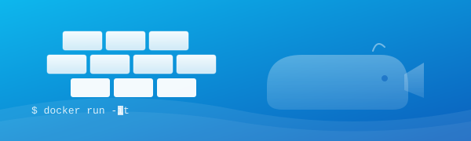
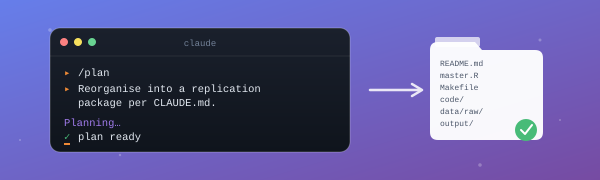

```{=html}
<div style="display: grid; grid-template-columns: repeat(3, 1fr); gap: 24px; max-width: 1100px; margin: 40px auto;">

  <a href="Docker/" style="text-decoration: none; color: inherit;">
    <div style="border-radius: 16px; overflow: hidden; box-shadow: 0 4px 15px rgba(0,0,0,0.1); transition: transform 0.2s, box-shadow 0.2s;">
      
      <div style="padding: 18px;">
        <h3 style="margin: 0 0 8px 0;">🐳 Docker for AI Agents</h3>
        <p style="color: #666; margin: 0; font-size: 0.88em;">
          Set up a safe, reproducible environment
          for AI coding agents with Docker.
        </p>
      </div>
    </div>
  </a>

  <a href="Getting_Started_Agents/" style="text-decoration: none; color: inherit;">
    <div style="border-radius: 16px; overflow: hidden; box-shadow: 0 4px 15px rgba(0,0,0,0.1); transition: transform 0.2s, box-shadow 0.2s; border: 2px solid #38B2AC;">
      <div style="width: 100%; height: 180px; background: linear-gradient(135deg, #38B2AC 0%, #234E52 100%); display: flex; align-items: center; justify-content: center; color: white; font-size: 3em;">🚀</div>
      <div style="padding: 18px;">
        <h3 style="margin: 0 0 8px 0;">🚀 Getting Started — Day 1</h3>
        <p style="color: #666; margin: 0; font-size: 0.88em;">
          Mental models, Aider + OpenRouter, token pricing,
          first session. The on-ramp before Day 2.
        </p>
      </div>
    </div>
  </a>

  <a href="AI_Agents/" style="text-decoration: none; color: inherit;">
    <div style="border-radius: 16px; overflow: hidden; box-shadow: 0 4px 15px rgba(0,0,0,0.1); transition: transform 0.2s, box-shadow 0.2s;">
      
      <div style="padding: 18px;">
        <h3 style="margin: 0 0 8px 0;">🤖 AI Agents — Day 2</h3>
        <p style="color: #666; margin: 0; font-size: 0.88em;">
          Turn a messy research folder into an AER-compliant
          replication package with Claude Code, Codex &amp; Gemini CLI.
        </p>
      </div>
    </div>
  </a>

</div>
```